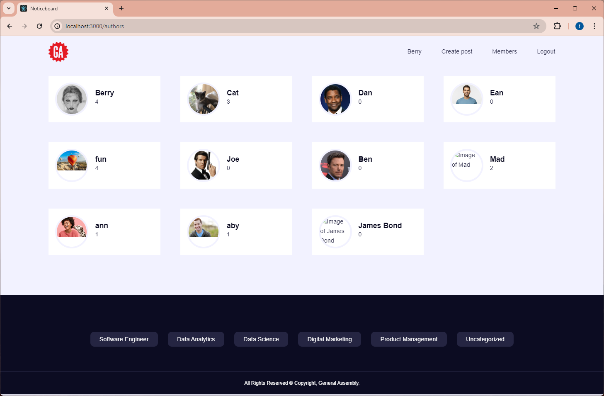

*Projects Goals*

To implement a blog for students/teachers to post,edit,upload image relating from Software Engineering to Data Analytics.

Click to use >> https://wb-frontend-one.vercel.app/

*Install/Used Dependencies*
Node.js
MongoDb/mongoose / npm i mongoose
Cloudinary
Express.js / npm i express
React version 18.2.0
Multer / npm install multer
bcryptjs / npm install bcryptjs
express version 4.19.2
jsonwebtoken / npm install jsonwebtoken
cors - npm install cors

*Code to run Application *
FrontEnd/Client - npm run start Backend/Server - npm run dev

*Technology Used*
MONGODB     - Database to store details of users and posts.
CLOUDINARY  - Used together with MondoDB, user upload their images and is stored via cloudinary URL
VERCEL      - Deployment

*Challenges*
 Trouble Deploying the Project on Vercel Corrs Policy Issue when connecting Front End to Back End.
 Having Difficuly stored images upload by user / used Cloudinary to overcome the issue.

 

